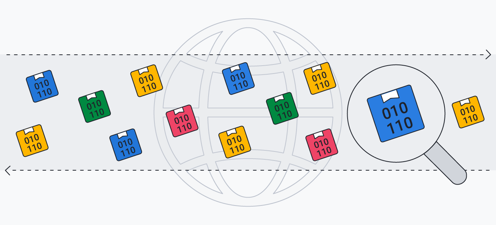

# DeepTrace


**DeepTrace** is a powerful low-level packet sniffer built by using Python and Scapy. This tool allows you to capture and analyze network traffic in real-time, providing insights into the underlying communication of network protocols.  
<br>
*The project is currently in progress and continuously being improved, **thus may not work when tested**. If this is the case, please report the error to me through my email under my profile page.*

## Features 💡

- Capture packets from a specific network interface.
- Filter captured packets by a target MAC address.
- Display real-time summaries of captured packets.
- Support for filtering packets by protocol (HTTP, TCP, UDP, IP).
- View detailed information about specific packets.
- Automatically detect the default network interface (platform-specific).
- Multithreaded packet sniffing for efficient performance.
- Ability to stop the sniffer after a user-defined duration.


## Requirements ⚙️

To run DeepTrace, ensure you have the following installed:

- Python 3.6 or later
- Scapy 2.4 or later

## Installation 📂 
*(Does NOT work yet, please bear with me while I add requirements.txt file and fix errors*  
Follow the steps below to install and set up DeepTrace:

1. Clone this repository:
    ```bash
    git clone https://github.com/daasfab/DeepTrace-PacketSniffer.git
    ```

2. Navigate to the project directory:
    ```bash
    cd DeepTrace-PacketSniffer
    ```

3. Create and activate a virtual environment (optional but recommended):
    ```bash
    python -m venv venv
    source venv/bin/activate  # On Windows use: venv\Scripts\activate
    ```

4. Install the required dependencies: 
    ```bash
    pip install -r requirements.txt
    ```

## Usage

To start capturing packets using DeepTrace, run the following command:

```bash
python deeptrace.py
